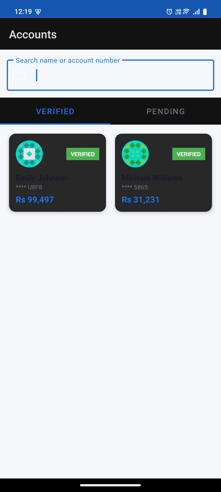

# Digital Bank KYC App

An Android application for a digital banking platform built with Kotlin.

## Features

- Browse customer accounts with Verified and Pending KYC sections
- Search customers by name or account number
- View detailed KYC profile for each customer
- Live bank & branch resolution from IFSC code via Razorpay IFSC API
- In-app selfie capture using CameraX for KYC verification
- Persistent KYC status and selfie storage across app restarts

## Tech Stack

- **Language:** Kotlin
- **Architecture:** MVVM (Clean Architecture)
- **DI:** Hilt
- **Networking:** Retrofit + OkHttp
- **Database:** Room
- **Camera:** CameraX
- **Image Loading:** Glide
- **Navigation:** Navigation Component

## APIs Used

- **DummyJSON** — Customer profiles and bank account data
- **Razorpay IFSC** — Live bank and branch resolution

## Screens

### Accounts Screen
- Verified and Pending tabs
- Customer cards with avatar, name, masked account number, balance
- Search bar to filter by name or account number

### Account Details Screen
- Full KYC profile (name, DOB, nationality, address, contact)
- Live bank details from IFSC code
- Do KYC / Re-take Selfie button

### Camera Screen
- In-app CameraX selfie capture
- Camera permission handling
- Saves selfie to internal storage

## Screenshots

| Accounts Screen | Account Details | Camera Screen |
|---|---|---|
|  |  |  |

## Setup

1. Clone the repository
2. Open in Android Studio
3. Sync Gradle
4. Run on device or emulator (API 24+)

## Project Structure
app/

├── data/

│   ├── api/# Retrofit API interfaces

│   ├── db/# Room database, DAO, entities

│   ├── model/# API response models

│   └── repository/# Data repository

├── di/# Hilt dependency injection

├── domain/

│   └── model/# Domain models

└── ui/

├── accounts/# Accounts screen + ViewModel

├── details/# Account detail screen + ViewModel

├── camera/# Camera screen + ViewModel

└── adapter/# RecyclerView adapter

## Notes

- KYC status and selfie persist across app restarts using Room DB
- API responses cached with OkHttp for offline support
- Camera uses CameraX — no system camera intent used
